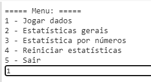
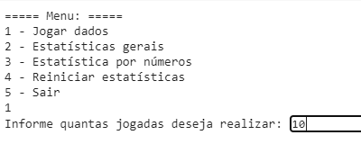
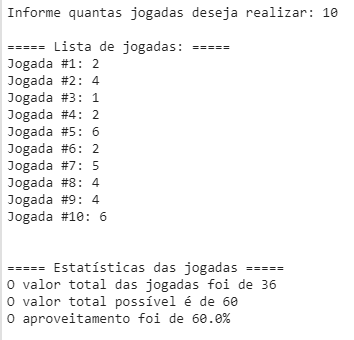
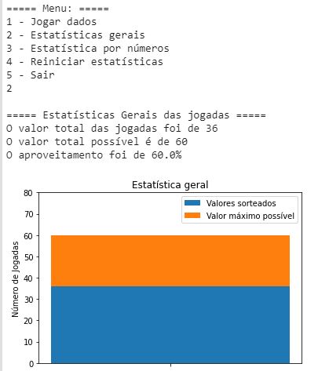
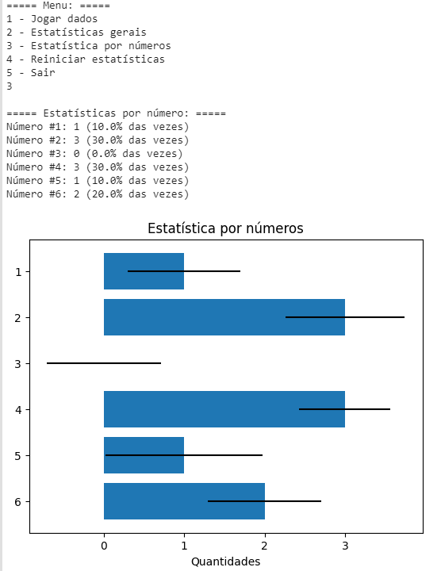

A script made with Python that has the objective to roll dice and create visual statistics with Matplotlib module.

## Featured Images

    
Menu
 
     

    
Input how many plays do you want
 
     

    
List of plays and statistcs
 
     

    
[Menu 2] General statistics (total value, max possible and average)
 
     

    
[Menu 3] Statistics by number
 
     

